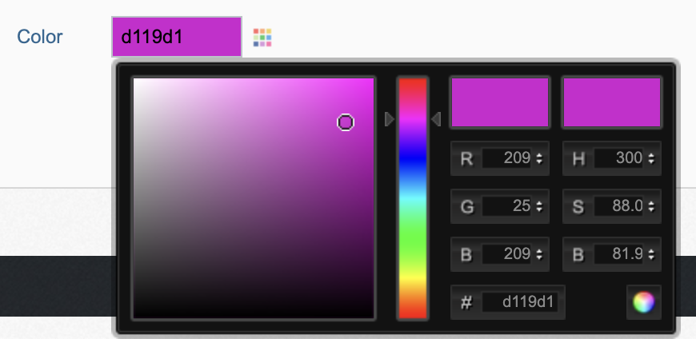
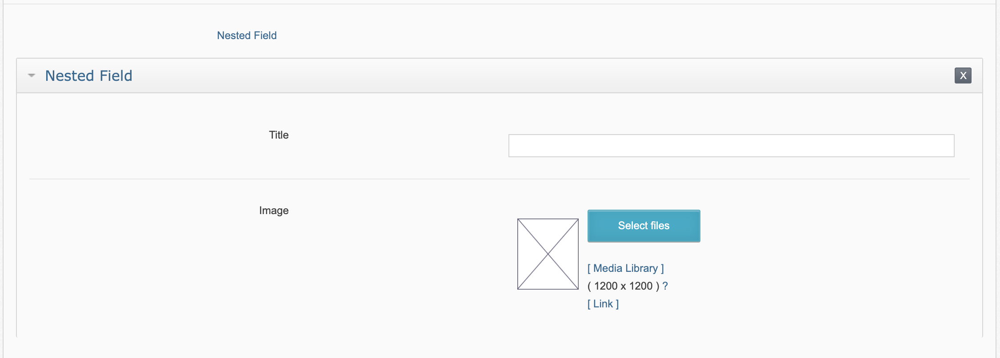
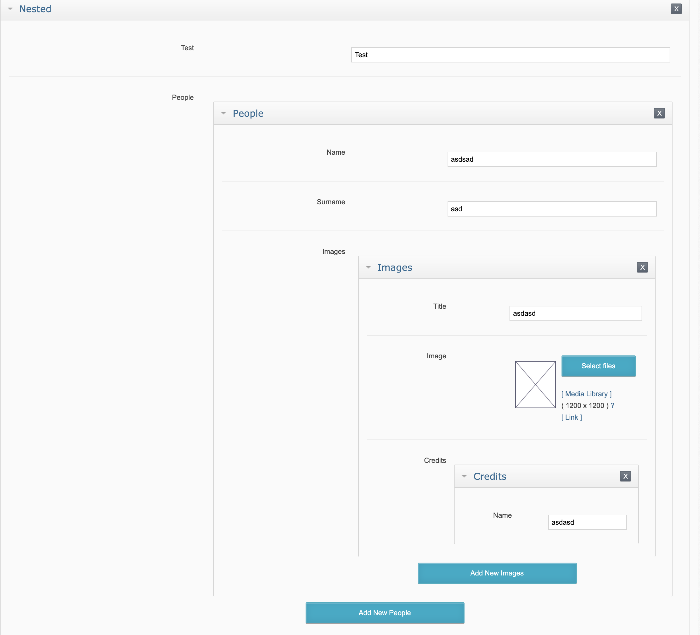

# Data Types

## Introduction

Objects are one of the most special component of Butterfly. Objects are tables with detailed definition.
While defining your object, you can define Url, Table Name, User Friendly Name etc. After defining your objects, you can
start editing your contents from your admin panel, without writing a single line of code.

When you create an Object from `butterfly panel` or `upgrade migration`, `table` (for SQL) or `collection` (for MongoDB) or `index` (for ElasticSearch) is automatically generator
which means that, you don't need to make Database creations manually.

You can checkout [Data Manager documentation](https://thebutterfly.io/docs/#/data-manager) for a brief introduction to Data Manager.

## Data Fields

All data types have their names and fields. For example: If you have data type named `blog_posts`, you would possibly need a 
Data Field named `title` with a type of `String`.

When you create an admin panel or using a migration script, `columns` (for SQL), `fields` (for MongoDB), `mapping` for Elastic Search is automatically created.

In other words, Data Field is equavilant to `columns` in SQL.

### String

Strings are field types which have a short text (maximum length: 255).

Parameters:

Name | Column Name | Description
--- | --- | ---
Limit| val_1 | Limits the number of characters in string. 

### Autocomplete

When you have more than one Data Type, you may need to link them. For example: If you have an E-commerce Orders Data Type, you would have a Customers Data Type,
Autocomplete Field Type makes it easier to link your fields.

Parameters:

Name | Column Name | Description
--- | --- | ---
Source Data Type | val_1 | Data Type you want to link
Display Field | val_2 | Data Field to be shown in listings
Value Field | val_3 | Source Data Field to be saved into current field
Condition | val_4 | Where clause for the source records

>[!TIP]
> For a cleaner database schema, Butterfly suggests following naming convention standard: If you want to link a field to other tables id column,
> you can name the singular version of the table name followed by `_id`. For example: If your Source Data Type is `customers` you can name field type as
> `customer_id`. When you use this syntax, Butterfly automatically detects the relationship and select rest inputs in `Data Field creation Admin Panel`

#### Updating minimum character length

By default autocomplete field type sends request when minimum character length is 2. You can update by applying following updates:

1) publish template of the page you want to override behaviour using `bin/butterfly publish:admin:template` table_name action
2) add following javascript to that page:
```html
<script>
  window.minCharacterLength = 1;
</script>
```

>[!TIP]
> If you want to change behaviour for all pages, you can simply use `bin/butterfly publish:admin:layout` to publish container layout for all pages and set the variable 
> for all pages.

### Color Picker

Color Picker Type provides a color picker for inputs. It stores color code as like FFFFFF.



>[!TIP]
> Notice that color picker saves colors without '#' prefix.

### Datetime

Datetime Field type is used to store Date & Time information in [Unix Timestamp format](https://en.wikipedia.org/wiki/Unix_time).
When you use this field type, it will create a column with type integer, since Unix Timestamp format designates the number of seconds 
have passed since 1th of January 1970.

This field type is suitable for Release Date's, Expiry Date's, Event Dates etc. Since it includes time and starts from 1970, we don't recommend this field type to be used 
for birth dates.

>[!TIP]
> When you need a content to be disappear from site before Release Date or Expiry Date automatically, you can use the following special column names:
> `release_date` for Publication Dates and `expiry_date` for auto Expiration.

### Checkbox

Checkbox Field type displays a checkbox as it's name describes. It will create a column with type tinyint.

It will save value "1" if field is checked and "0" if it's not checked. 

### Image Upload

#### Introduction

Image Upload field type is a specialized Image Upload Tool. You can upload images, generate sub images, crop images from Admin Panel.
You can also enable Media Library for re-using uploaded images.

Parameters:

Name | Column Name | Description
--- | --- |---
Alias | val_1 | Image Upload alias to define upload paths, manipulation options etc.

Supported file types are:

* jpg, jpeg
* png
* gif
* svg

> [!TIP]
> Butterfly has support for cropping / resizing `gif` images. Which means that, you can upload gif images and if defined,
> it will be resized or cropped without loosing the animation. 

> [!WARNING]
> Since SVG is a format composed of XML, image manipulation operations are not supported when you upload svg files.

#### Operation Types

##### No Operation

Image will not be updated. Just uploaded as is.

##### Resize

Image will be resized first to resize in a box with given sizes.

For example:
If you have an image with size: 1000x1200 and the configution is set to resize image to 600x600. The image will be
resized to 500x600

> [!TIP]
You can define just one dimension to fit the image to that dimension. Other dimension will resized respectively constraining proportion.

##### Center Crop

Image will be resized first and cropped from wider size that outfits given sizes.

For example:
If you have an image with size: 1000x1200 and the configution is set to center crop image to 500x500.
 First, the image will be resized to 500x600, then it will be cropped to 500x500 which means that, 50px from both side
 of the image will be removed.

##### Fill

Image will be resized first to resize in a box with given sizes. Then it will be filled with given fill color to fit given size.

For example:
If you have an image with size: 1000x1200 and the configution is set to fill image to 600x600
 First, the image will be resized to 500x600 then it will be filled with solid color (white by default) to fit 600x600

### Block

While creating content, you can use texterea if you don't have styles or other type of contents like image or so in your content; 
another alternative is textarea_with_editor which includes a Text Editor.

Problem with Rich Text Editors is it creates HTML output which is nearly impossible to process on Mobile Applications or so.

Block field type is as it's name designates is a rich text content editor which outputs JSON including json information about Blocks.

You can enable / disable blocks per Data Field and also you can add custom blocks for your Field Type.

You can check [EditorJS Website](https://editorjs.io) for more information about EditorJS. 

### Nested

When you want to store your multiple rows / fields in a single field as JSON, you can use Nested Field Type.

As it's name explains, in nested fields, you can build your JSON using other field types.

Parameters:

Name | Column Name | Description
--- | --- |---
Configuration | val_1 | Field Configuration of the field as YAML (Example is below)
Sortable | val_2 | Whether sub-fields can be sorted or not.
Multiple | val_3 | If yes, you can add multiple rows

Example Configuration:

```yaml
title:
    name: 'Title'
    type: 'string'
image:
    name: 'Image'
    type: 'image_upload'
    val_1: 'content'
```

will save the data in Database like follows:

```json
[
  {
    "title": "Test Title",
    "image": "content/12-10/01/test.png"
  }   
]
```

will output:



>[!TIP]
> You can use nested field recursively, which means that, you can build endlessly deep JSON using the following example.

More complex example:

```yaml
test:
    name: 'Test'
    type: string
people:
    name: 'People'
    type: nested
    val_1:
        name:
            name: 'Name'
            type: string
        surname:
            name: 'Surname'
            type: string
        images:
            name: 'Images'
            type: nested
            val_1:
                title:
                    name: 'Title'
                    type: string
                image:
                    name: 'Image'
                    type: image_upload
                    val_1: content
                people:
                    name: 'Credits'
                    type: 'nested'
                    val_1:
                        name:
                            name: 'Name'
                            type: 'string'
            val_2: 1
            val_3: 1
    val_2: 1
    val_3: 1
```

will save the data in Database like follows:

```json
[
  {
    "test": "Test",
    "people": [
       {
        "name": "Test",
        "surname": "Surname",
        "images": [
          {
            "title": "Test",
            "image": "20-09/01/test.png",
            "credits": [
              {
                "name": "Name - 1"
              },
              {
                "name": "Name - 2"
              }     
            ]   
          }   
        ]
       }  
    ]
  },
  {
      "test": "Test - 2",
      "people": [
         {
          "name": "Test - 2",
          "surname": "Surname",
          "images": [
            {
              "title": "Test - 2",
              "image": "20-09/01/test-2.png",
              "credits": [
                {
                  "name": "Name - 3"
                },
                {
                  "name": "Name - 4"
                }     
              ]   
            }   
          ]
         }  
      ]
    }  
]
```

will output:



### Code

Code Field Type, displays a Code Editor in Admin. It automatically checks for Syntax error and highlights codes to present 
a user-friendly Code Input.

Supported Languages:
* css
* html
* javascript
* json
* smarty
* xml
* yaml
* twig

Parameters:

Name | Column Name | Description
--- | --- |---
Language | val_1 | Code Language

## Data Validation

Butterfly allows field based data validation with these options;

- Email
- Phone
- Password
- Url
- Unique
- Accessibility

## Permissions

You can define permissions per Object / per User Group in Butterfly Panel.

There are three main types of permissions:

- [Generic Permissions](#generic-permissions)
- [Permission Exceptions](#permission-exceptions)
- [Custom Permissions](#custom-permissions)

### Generic Permissions

Using Generic Permissions, you can define permissions for each Object / Object Spec.

>[!TIP]
> You can define permission exceptions to limit the User's permission to the defined Record Set. For example: You may want to 
> grant user to edit Products in a specific Category. Or you may want your Junior Editor's to create Articles in a Pending State.
> This definitions are handled in [Permission Exceptions](#permission-exceptions).

#### Add Permission:

This permission grants user to add a new Record to the Object.  

#### Edit

This permission grants user to edit an existing Record of the Object.

#### View

This permission grants user read only view access for existing Records of the Object 

#### Delete

This permission grants user delete permission for Records of the Object.

### Permission Exceptions

You may want to grant user to edit Products in a specific Category. Or you may want your Junior Editor's to create Articles in a Pending State.

### Custom Permissions

Custom Permissions are used for the Custom Permission checks. Permissions are saved in Permission Defitions Object in `cms_permissions`. You should also
define Permission Groups to group permissions.

#### Check Permission

You can check defined permissions for the logged in user using the following example:

```php
$mUser = new \Butterfly\Core\Model\User();
$mUser->checkCustomPermission('sales-order', 'approve');
```

```smarty
{'sales_order::approve'|custom_permission}
```

#### Grant Permission

Grant permission is used to Log Custom Permission granted to user.

> [!WARNING]
> Grant Permission Work In Progress. You can start using function calls for the future reference.

```php
$mUser = new \Butterfly\Core\Model\User();
$mUser->grantCustomPermission('sales-order', 'approve', [
        'entity_id' => 1234, 
        'object_id' => \Butterfly\Core\Model\Objects::getObjectId('orders'),
        'comment' => 'Testing' 
    ]
);
```

## Hooks

You can intercept operations like Insert, Update or Delete on Panel. For example, you may want to check an external service 
before a new entry is added to database, or you may want to send data to an external service.

### Hook Creation

You can create a hook using the following command:

```bash
bin/butterfly make:hook users
```  

this will create a file in app/Hook/Users.php.

Then, when a new entry is saved in admin panel, it will run related function in this hook.

### Event Functions

Hook functions are as follows:

#### before_add

This function is triggered before adding new entry. You can stop the operation by calling error function, or 
you can use confirm function to alert user before doing the operation.

> When you use before_ functions, since the operation is not done yet, you can run error function; you should use before function if you want to stop operation.

> [!DANGER]
> We don't have an id yet when before_add operation is triggered.

Following Hook will halt to operation and display an error on screen:

```php
<?php

namespace App\Hook;

use Butterfly\Framework\Data\Crud;
use Butterfly\Library\Hook;

class Users extends Hook
{
    public function before_add(Crud &$crud)
    {
        $crud->error('No way !');
    }
}
```

#### after_add

This function is triggered after adding new entry. You can use this function if you want to run your trigger
 when entry is actually added.
 
 ```php
<?php

namespace App\Hook;
 
use Butterfly\Framework\Data\Crud;
use Butterfly\Library\Hook;
 
class Users extends Hook
{
    public function after_add(Crud &$crud)
    {
        $data = $crud->getData();
        $newId = $crud->getDataId();
    
        // You can call external service with $data variable here
    }
}
```

#### before_edit

This function is triggered before updating an entry. You can also check if there is a difference with previous state using 
[`isChanged`](#isChanged) function. You can also get the old info using [`getOldData`](#getOldData) function.

```php
<?php

namespace App\Hook;
 
use Butterfly\Framework\Data\Crud;
use Butterfly\Library\Hook;
 
class Users extends Hook
{
    public function before_edit(Crud &$crud)
    {
        // Following if block will ask user confirmation.
        if($crud->isChanged('name'))
        {
            $oldData = $crud->getOldData('name');
            $newData = $crud->get('name');
                
            $crud::confirm('You are changing name from ' . $oldData . ' to ' . $newData . '. Are you sure?');
        }
    }
}
```

#### after_edit

This function is triggered after updating an entry.

> [!WARNING]
> You cannot use `isChanged` and `getOldData` functions on after_edit section because the data is already updated. Because
> of that, `isChanged` will always return `false` and `getOldData` will return the new data.

> [!TIP]
> You can use `before_edit` hook to check `isChanged` and `getOldData` and set the data to a variable in `$this` context. Then,
> you can use variables you've created to access this information.   

```php
<?php

namespace App\Hook;
 
use Butterfly\Framework\Data\Crud;
use Butterfly\Library\Hook;
 
class Users extends Hook
{
    private $nameIsChanged;
    private $oldName;

    public function before_edit(Crud &$crud)
        {
            $this->nameIsChanged = $crud->isChanged('name');
            $this->oldName = $crud->getOldData('name');
        }

    public function after_edit(Crud &$crud)
    {
        // Now, you can use $this->nameIsChanged or $this->oldName variables to access this information.
    }
}
```

#### before_delete

This function is triggered before deleting an entry. You can access the data to be deleted by using `$crud->getDataId()` function.
It will retrieve the id that will be deleted. Since the operation is not done yet, you can also access the data.

#### after_delete

This function is triggered after deleting an entry. Only parameter you can access is the ID `$crud->getDataId()` of the entry, since it's deleted from
the database. 

#### after_save

This function is triggered after successfully saving an entry. You can do whatever you need with your entity.

Example usage for the event to invalidate AMP Cache. Add this class into app\Hook folder.
```php
<?php

namespace App\Hook;

use Butterfly\Library\Hook;

class Objects extends Hook
{
    public function afterSave($params)
    {
        \Queue::push(\Butterfly\Core\Task\AmpCache::class, $params);
    }
}
```
 
### Crud Functions

#### get

You can use `get` function to get value of a specific field.

Example:

```php
<?php

namespace App\Hook;

use Butterfly\Framework\Data\Crud;
use Butterfly\Library\Hook;

class Users extends Hook
{
    public function before_add(Crud &$crud)
    {
        $name = $crud->get('name');

        // Now we have name value in `$name` variable. You can use it for further operations.
    }
}
``` 

#### error

You can trigger error and stop the operation using this function.

> [!WARNING]
> You should use `error` function with before_ events, since the operation is not done when before_ events are triggered.

Example:

```php
<?php

namespace App\Hook;

use Butterfly\Framework\Data\Crud;
use Butterfly\Library\Hook;

class Users extends Hook
{
    public function before_add(Crud &$crud)
    {
        $crud->error('No way !');
    }
}
```

#### confirm

You can use confirm function when you want to get yes / no confirmation from user. If user clicks to no, it will cancel 
the operation. If user clicks OK, then the operation will continue. 

```php
<?php

namespace App\Hook;

use Butterfly\Framework\Data\Crud;
use Butterfly\Library\Hook;

class Users extends Hook
{
    public function before_add(Crud &$crud)
    {
        // The following should not be placed before calling confirm function
        // Because this code will run twice after user confirms the dialog. You can move this function
        // call after confirm function.
        db()->table('test')->update([
            'test' => 5
        ]);

        $crud->confirm('Are you sure?');
    }
}
```

!> When you use confirm function, Hook code which is written before confirmation runs twice. You should not write code that 
should not be called more than once before calling confirm function.

#### getDataId

You can use getDataId function to retrieve the id of relevant column.

> [!DANGER]
> You cannot use this function inside of before_add since record is not created yet which means there is no id.

```php
<?php

namespace App\Hook;

use Butterfly\Framework\Data\Crud;
use Butterfly\Library\Hook;

class Users extends Hook
{
    public function after_add(Crud &$crud)
    {
        $newId = $crud->getDataId();

        // We have the id of new record, so you can use it for further operations.
    }
}
```

#### getOldData

When user saves data from Butterfly Panel, you can get it's previous state using getOldData function.

```php
<?php

namespace App\Hook;

use Butterfly\Framework\Data\Crud;
use Butterfly\Library\Hook;

class Articles extends Hook
{
    public function before_edit(Crud &$crud)
    {
        $oldTitle = $crud->getOldData('title');

        // You have the title of the article you can use it for further operations.
    }
}
```

> [!NOTE]
> `getOldData` function gets data from Database when it's called. Since database is updated before calling after_ events, if you call this function in after function, it will not work properly and return the latest data. If you need old data in after_ events, then, you can call it in before function and set it to another property.

#### isChanged

When user saves data in Butterfly Panel, you may want to check if a specific field is changed or not.  

> [!WARNING]
> `isChanged` function returns if the field is changed or not. Since database is updated before calling after_ events, if you call this function in after function, it will not work properly and return the latest data. If you need old data in after_ events, then, you can call it in before function and set it to another property.

In the following example, confirmation dialog will be displayed if the user changed `title`:

```php
<?php

namespace App\Hook;

use Butterfly\Framework\Data\Crud;
use Butterfly\Library\Hook;

class Articles extends Hook
{
    public function before_edit(Crud &$crud)
    {
        if($crud->isChanged('title'))
        {
            $oldTitle = $crud->getOldData('title');
            $newTitle = $crud->get('title');
        
            $crud->confirm('You have changed title from : ' . $oldTitle . ' to ' . $newTitle 
                . '. Are you sure?');
        }

        // You have the title of the article you can use it for further operations.
    }
}
```